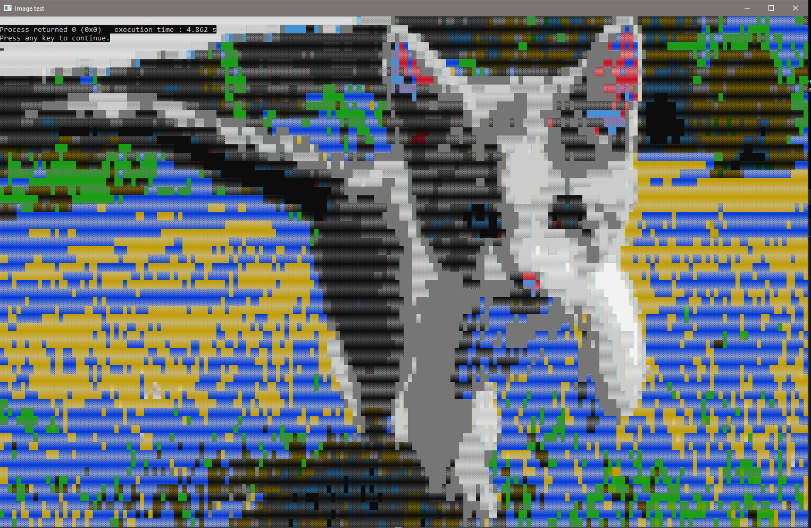

# RGB555toCHARINFO
This is a CHARINFO LUT generator using bruteforce (tensorflow's ancestor)

# Method
The method consists in combining the color of the character as well as the background color of these 3 characters: ░, ▒ and ▓.
The result obtained is compared with the colors of the RGB spectrum to obtain the shortest distance, and finally generate a more or less potable LUT.

# Result of kitten (190x60):

